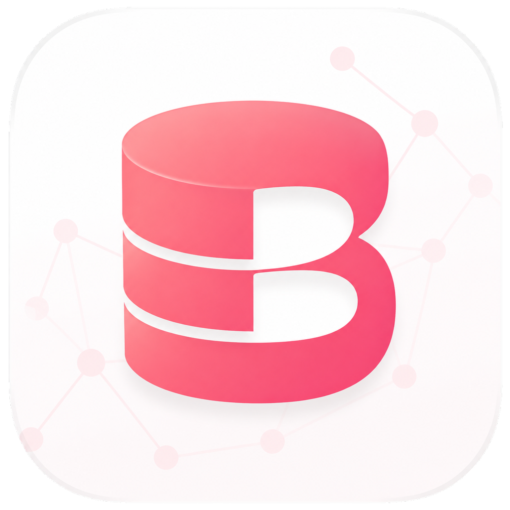
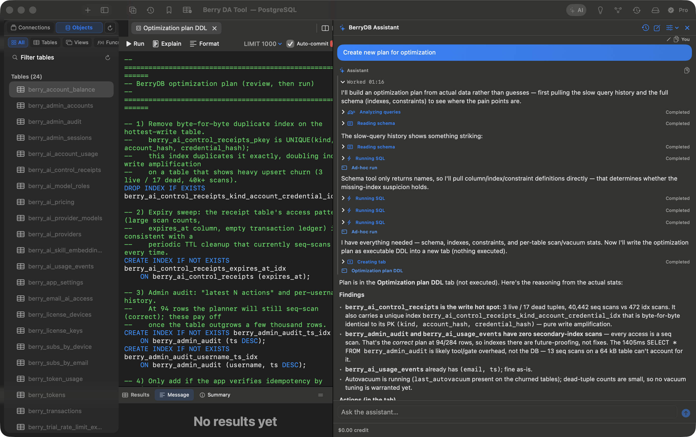

<div align="center">



# BerryDB 🫐

### The Ultra-Fast, Native Database Client Built Exclusively for macOS Speed

[](https://apple.com/macos)
[](https://swift.org)
[](https://db.berryhub.app)
[](LICENSE)
[](https://ko-fi.com/dautay)

<p align="center">
  <b>Cold start under 1s</b> • <b>1M rows streamed for ~6MB</b> • <b>AI SQL Copilot</b> • <b>Apple Keychain Security</b>
</p>

<p align="center">
  <a href="https://download-db.berryhub.app/BerryDB-latest.dmg"><b>Download .DMG (macOS 15+)</b></a> •
  <a href="https://db.berryhub.app"><b>Official Website</b></a> •
  <a href="https://ko-fi.com/dautay"><b>☕ Donate on Ko-fi</b></a>
</p>

---



</div>

<br/>

## 📖 Overview

**BerryDB** is an ultra-fast, lightweight, and modern database management tool crafted specifically for macOS developers, data engineers, and DBAs. Built 100% natively using **Swift 6, SwiftUI, and AppKit**, BerryDB completely eliminates the bloat, sluggishness, and high memory footprint of Electron-based clients.

Whether you're querying production PostgreSQL databases, inspecting Redis caches, managing MongoDB collections, exploring Qdrant vector spaces, or querying SQLite files locally, BerryDB delivers instantaneous responsiveness with Apple Keychain enclave security.

---

## ✨ Key Features

### ⚡ Pure Native Speed (Zero Electron Bloat)
- **Fast Launch**: A window is on screen about 0.85s after a cold start — no Chromium runtime, no NodeJS backend overhead.
- **Memory That Does Not Grow With Your Data**: streaming 1,000,000 rows costs about 5.5MB of peak memory — the same as 200,000 rows.
- **AppKit Virtualized Data Grid**: A native `NSTableView` engine that scrolls and streams **1,000,000+ rows** without holding them all in memory.

> Measured on an Apple M1 (16GB, macOS 26.6.2) with a release build. Run `scripts/measure-performance.sh` to reproduce them on your own machine — it reports process spawn and first window separately, because they are not the same number.

### 🗄️ Multi-Engine Database Support
Connect to SQL, NoSQL, Key-Value, and Vector databases all in a unified native workspace:
- **Relational / SQL**:
  - **PostgreSQL**: Native wire protocol (`PostgresNIO`), query cancellation via `pg_cancel_backend`, SSL/TLS.
  - **MySQL & MariaDB**: Native driver (`MySQLNIO`), full support for `caching_sha2_password` and `mysql_native_password`, SSL/TLS, `KILL QUERY`.
  - **SQLite**: Direct embedded driver via `libsqlite3`, WAL mode support, instant file inspection.
  - **Microsoft SQL Server**: High-compatibility TDS protocol bridge via dynamically linked FreeTDS (`libsybdb`).
- **In-Memory & Key-Value**:
  - **Redis & Valkey**: High-speed Valkey-Swift driver, key browser, real-time TTL inspection, and interactive viewers for Strings, Hashes, Lists, Sets, and Sorted Sets.
- **Document & Cloud NoSQL**:
  - **MongoDB**: Collection browser, JSON document editor, custom filter syntax, and Replica Set support.
  - **AWS DynamoDB**: Query via PartiQL syntax, item inspection, and AWS SigV4 authentication.
- **Vector & Full-Text Search**:
  - **Elasticsearch**: Cluster health monitoring, indices browser, and search query execution.
  - **Qdrant**: Vector collections browser and distance metric inspector.

### 🔒 Apple Keychain Enclave & Enterprise Security
- **Hardware Enclave**: All passwords, tokens, and SSH keys are stored directly in macOS Keychain. No plaintext credentials on disk.
- **Built-in SSH Tunneling**: Powered by Citadel (pure Swift SSH client) for secure bastion jump hosts without relying on external terminal sessions.
- **TLS/SSL Encryption**: Full encryption support with custom CA, client certificate, and verification options.

### 🤖 Intelligent AI SQL Copilot
- **Context-Aware SQL Generation**: Turn natural language into optimized SQL queries with automatic database schema injection.
- **Query Explanation & Tuning**: Instant `EXPLAIN` analysis, bottleneck detection, and index recommendations.
- **Chat with Your Database**: Ask questions about your schema, tables, and relationships directly inside the integrated AI panel.

### 📊 Database Intelligence & ER Diagrams
- **Mermaid.js ER Diagrams**: Automatically generate interactive visual Entity-Relationship diagrams from your database schema.
- **Table Analytics & Health**: Real-time table sizing, index usage statistics, and row count estimations.
- **Persistent Query History**: Searchable query log with execution duration, row counts, and one-click re-run.

### ✏️ Pro Query Editor & Inline Data Editing
- **Atomic Inline Editing**: Edit table cells directly in the grid with staged diff reviews and atomic commits.
- **Code Editor**: SQL syntax highlighting, keyword autocomplete, line numbering, and multiple tab sessions.
- **Query Cancellation**: Safely cancel long-running queries without hanging or crashing your application.

---

## 📊 Database Compatibility Matrix

| Database Engine | Driver / Protocol | Direct Connection | SSH Tunnel | Inline Grid Edit | Schema / ERD |
| :--- | :--- | :---: | :---: | :---: | :---: |
| **PostgreSQL** (12–16+) | Pure Swift (`PostgresNIO`) | ✅ | ✅ | ✅ | ✅ |
| **MySQL / MariaDB** (5.7, 8.x) | Pure Swift (`MySQLNIO`) | ✅ | ✅ | ✅ | ✅ |
| **SQLite** (3.x) | Embedded (`libsqlite3`) | ✅ | N/A | ✅ | ✅ |
| **Microsoft SQL Server** (2017+) | FreeTDS (`libsybdb`) | ✅ | ✅ | ✅ | ✅ |
| **Redis / Valkey** (6.x–8.x) | Pure Swift (`valkey-swift`) | ✅ | ✅ | ✅ (KV Editor) | ✅ (Keyspace) |
| **MongoDB** (5.x–7.x) | Pure Swift (`MongoWireClient`) | ✅ | ✅ | ✅ (JSON Edit) | ✅ (Collections) |
| **AWS DynamoDB** | AWS REST + SigV4 | ✅ | ✅ | ✅ | ✅ (Tables) |
| **Elasticsearch** (7.x–8.x) | REST Client | ✅ | ✅ | 👁️ (Read/Search) | ✅ (Indices) |
| **Qdrant** | REST Client | ✅ | ✅ | 👁️ (Read/Search) | ✅ (Collections) |

---

## 🚀 Installation & Quick Start

### Option 1: Download Pre-built DMG (Recommended)

1. Download the latest release `.dmg` from [download-db.berryhub.app/BerryDB-latest.dmg](https://download-db.berryhub.app/BerryDB-latest.dmg).
2. Open the `.dmg` file and drag **BerryDB.app** into your **Applications** folder.
3. Launch BerryDB from Spotlight (⌘Space) or Launchpad.

> **System Requirements**: macOS 15.0 (Sequoia) or later. Apple Silicon only (M1/M2/M3/M4).

### Option 2: Build from Source

BerryDB uses the standard Swift Package Manager (SPM) and `make`.

#### Prerequisites
- macOS 15.0 or higher
- **Xcode 16.0+** (with Swift 6 toolchain)
- **FreeTDS library**: `brew install freetds` (required for FreeTDS / SQL Server C headers)

#### Build Steps
```sh
# 1. Clone repository
git clone https://github.com/berry-apps/berrydb-desktop.git
cd berrydb-desktop

# 2. Setup local development configuration
cp .env.example .env

# 3. Build debug bundle and launch application
make run
```

#### Available Make Commands
| Command | Description |
| :--- | :--- |
| `make run` | Build debug app bundle, package into `dist/BerryDB.app`, and launch. |
| `make watch` | Watch for file changes, auto-rebuild, and reload application. |
| `make test` | Run the complete Swift unit and integration test suite. |
| `make app` | Build optimized release application bundle in `dist/BerryDB.app`. |

---

## 🎯 User Guide

### 1. Adding a Database Connection
1. Click **New Connection** (⌘N) or select the `+` button in the sidebar.
2. Choose your database type (PostgreSQL, MySQL, SQLite, Redis, MongoDB, SQL Server, etc.).
3. Enter your connection credentials (Host, Port, User, Password, Database).
   - *Optional*: Toggle **SSH Tunnel** to route traffic through a jump server.
   - *Optional*: Toggle **SSL/TLS** for secure encrypted connections.
4. Click **Test Connection** to verify connectivity, then click **Save**. Passwords are encrypted securely in your macOS Keychain.

### 2. Navigating Schema & ER Diagrams
- Use the sidebar schema tree to browse tables, views, columns, keys, and indexes.
- Right-click any table and select **Show ER Diagram** to inspect foreign key relationships rendered via Mermaid.js.

### 3. Writing Queries & Using the AI Copilot
- Press **⌘T** to open a new query editor tab.
- Type SQL queries with keyword completion, then press **⌘Return** to execute.
- Open the **AI Assistant** panel (or press **⌘J**):
  - Type a natural language prompt, e.g. *"Show top 10 customers by revenue this month"* or *"Find slow queries and suggest index optimization"*.
  - Review generated SQL and click **Run** or **Insert to Editor**.

### 4. Editing Data Directly in the Grid
- Double-click any cell in the `NSTableView` data grid to edit values inline.
- Edited rows are highlighted in amber. Click **Apply Changes** to commit them atomically or **Discard** to revert.

---

## ☕ Support the Project (Donate)

BerryDB is completely free and open-source for all local database management capabilities. If BerryDB saves you time, enhances your workflow, or replaces expensive subscription tools, consider buying the creators a coffee:

<div align="center">

[](https://ko-fi.com/dautay)

### 👉 **[https://ko-fi.com/dautay](https://ko-fi.com/dautay)**

Your support helps cover Apple Developer program fees, maintain server infrastructure, and fuel continuous feature development!

</div>

---

## 🤝 Contributing

Contributions, issues, and feature requests are welcome!
1. Fork the repository.
2. Create your feature branch (`git checkout -b feature/AmazingFeature`).
3. Commit your changes (`git commit -m 'feat: add amazing feature'`).
4. Push to the branch (`git push origin feature/AmazingFeature`).
5. Open a Pull Request.

---

## 📄 License & Third-Party Notices

BerryDB is open-source software licensed under the **[Apache License 2.0](LICENSE)** — free for personal and commercial use.

For detailed third-party attributions and compliance (including LGPL-2.1 dynamic linking compliance for FreeTDS), please refer to **[THIRD-PARTY-NOTICES.md](THIRD-PARTY-NOTICES.md)**.
